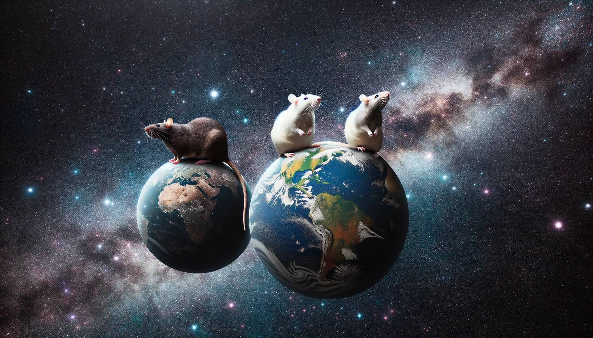

# planet.github.io

</img>

## My page

<a href="rat.md">Roberts Page</a>
## GitHub Pages site

Dev blog: [https://planet.github.io/dev-blog](https://planet.github.io/blog)

Pre-installed GitHub Jekyll Themes: [GitHub Pages Themes](https://pages.github.com/themes/)

# My Projects
Here are a list of projects I'm working on:

- [Project](https://github.com/PlanetaryPinky/CTS285-Project-1) - A simple project
- [Blog](https://github.com/planet/blog) - Simple blog page

# Useful Links
- [Markdown Tutorials](https://www.w3schools.com/)
- [GitHub Pages Quickstart](https://pages.github.com)

# Information for CTI 110
- Remember, you'll want to build on your skills by taking more programming classes! CSC 134, CSC 121, CSC 151 are good next steps.
- Al Sweigart's books are free online and a good place to keep working on Python. Check them out [here](https://inventwithpython.com/) and this specifically recommended [book](https://inventwithpython.com/invent4thed/).

# CTS285 Layout
If your webpage has the information below, you're in good shape.

## User Stories
- You can either list the stories in a simple list or link to the Project Board (Kanban board) where you have the stories listed.

## Diagrams
For now, just the Context Diagram (Diagram Zero).

### More Information
[Dataman](Calculator.py)
